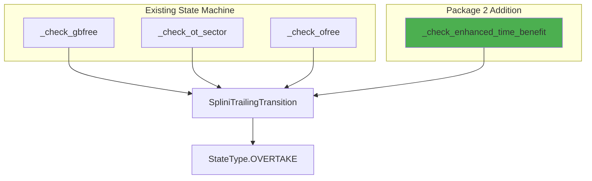
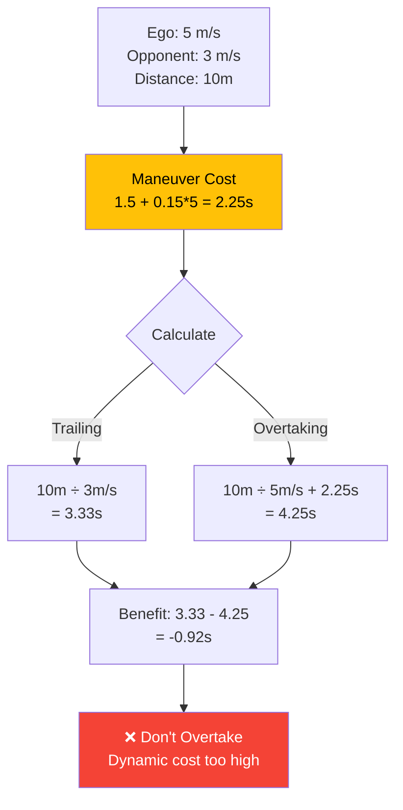

# Package 2: Enhanced Decision Planner - Implementation

## Overview

Package 2 adds intelligent time-benefit analysis to the ForzaETH state machine's overtaking decisions. Instead of overtaking whenever an opportunity arises, the system now evaluates whether the maneuver actually saves time compared to trailing the opponent.

**Key Feature**: Only overtake when time saved ≥ 0.5 seconds (configurable)

## Message Interface

Package 2 is a pure decision layer that enhances existing state machine logic without publishing new topics.

### Input Topics

```
/car_state/frenet/odom (nav_msgs/Odometry)
└─ Provides: Ego velocity (self.cur_vs from msg.twist.twist.linear.x)
└─ Purpose: Calculate time-overtaking based on our speed

/perception/obstacles (f110_msgs/ObstacleArray)
└─ Provides: Opponent position (s_center, d_center) and velocity (vs)
└─ Purpose: Find closest opponent and calculate time-trailing

/overtake_opportunity (f110_msgs/OvertakeOpportunity) [OPTIONAL - Future]
└─ Provides: Safe zone indication from Package 1
└─ Purpose: Coordinate with curvature-based track analysis
```

###

 Output

**No new topics published** - Package 2 modifies state transitions internally

```mermaid
graph LR
    A[/car_state/frenet/odom] -->|cur_vs| SM[State Machine]
    B[/perception/obstacles] -->|opponent data| SM
    SM -->|enhanced checks| T[Transition Logic]
    T --> D{OVERTAKE?}
```

## Architecture

### Design Pattern: Property-Based Checks

The state machine already uses `@property` decorators for transition conditions. Package 2 follows this existing pattern to maintain code consistency.

**Existing Pattern**:
```python
@property
def _check_gbfree(self) -> bool:
    """Returns True if global track is obstacle-free"""
    # Implementation checks obstacles within horizon
```

**Package 2 Addition**:
```python
@property
def _check_enhanced_time_benefit(self) -> bool:
    """Returns True if overtaking saves time"""
    # Implementation compares trailing vs. overtaking time
```

### Integration Strategy: Additive, Not Destructive

Package 2 adds **one additional AND condition** to the existing overtaking transition logic.

**Before (transitions.py:72)**:
```python
elif (
    not gb_free
    and ot_sector
    and state_machine._check_availability_splini_wpts
    and state_machine._check_ofree
):
    return StateType.OVERTAKE
```

**After (transitions.py:77)**:
```python
elif (
    not gb_free
    and ot_sector
    and state_machine._check_availability_splini_wpts
    and state_machine._check_ofree
    and state_machine._check_enhanced_time_benefit       # Package 2
):
    return StateType.OVERTAKE
```


```mermaid
flowchart TB
    subgraph "Existing State Machine"
        E1[_check_gbfree]
        E2[_check_ot_sector]
        E3[_check_ofree]
    end

    subgraph "Package 2 Addition"
        P1[_check_enhanced_time_benefit]
    end

    E1 & E2 & E3 & P1 --> TR[SpliniTrailingTransition]
    TR --> OT[StateType.OVERTAKE]

    style P1 fill:#4CAF50
```

## Implementation

### Time-Benefit Analysis Formula

**Core Concept**: Compare time spent trailing opponent vs. time spent overtaking

```python
def calculate_time_benefit(ego_velocity, opponent_velocity, distance=10.0):
    # DYNAMIC maneuver cost based on velocity
    maneuver_cost = base_maneuver_cost + velocity_cost_factor * ego_velocity

    time_trailing = distance / opponent_velocity
    time_overtaking = distance / ego_velocity + maneuver_cost

    return time_trailing - time_overtaking  # Positive = saves time
```

**Key Innovation**: **Dynamic maneuver cost** - Higher speeds increase lane change time/risk

**Formula**: `maneuver_cost = 1.5s + 0.15 * ego_velocity`
- At 3 m/s: 1.5 + 0.15(3) = 1.95s
- At 5 m/s: 1.5 + 0.15(5) = 2.25s
- At 8 m/s: 1.5 + 0.15(8) = 2.70s

### Example Calculation

**Scenario**: Ego at 5 m/s, Opponent at 3 m/s, Distance 10m

```
Maneuver Cost (DYNAMIC):
  1.5s + 0.15 * 5 m/s = 2.25 seconds

Trailing Time:
  10m ÷ 3 m/s = 3.33 seconds

Overtaking Time:
  10m ÷ 5 m/s + 2.25s maneuver = 4.25 seconds

Time Benefit:
  3.33s - 4.25s = -0.92 seconds

Decision:
  -0.92s < 0.5s threshold → ❌ DON'T OVERTAKE
  (Dynamic maneuver cost makes overtaking inefficient)
```


```mermaid
graph TD
    A[Ego: 5 m/s<br/>Opponent: 3 m/s<br/>Distance: 10m] --> M[Maneuver Cost<br/>1.5 + 0.15*5 = 2.25s]
    M --> B{Calculate}
    B -->|Trailing| C[10m ÷ 3m/s<br/>= 3.33s]
    B -->|Overtaking| D[10m ÷ 5m/s + 2.25s<br/>= 4.25s]
    C & D --> E[Benefit: 3.33 - 4.25<br/>= -0.92s]
    E --> F[❌ Don't Overtake<br/>Dynamic cost too high]

    style F fill:#f44336,color:#fff
    style M fill:#FFC107,color:#000
```

## Code Locations

| Component | File | Line | Purpose |
|-----------|------|------|---------|
| **Decision Logic** | `state_machine/enhanced_decision/decision_logic.py` | 28 | `calculate_time_benefit()` method |
| **Check Method** | `state_machine/state_machine.py` | 395 | `_check_enhanced_time_benefit()` property |
| **Transition Integration** | `state_machine/transitions.py` | 77 | Added condition to `SpliniTrailingTransition()` |
| **Parameters** | `stack_master/config/state_machine_params.yaml` | 30 | Configuration values |
| **Parameter Declarations** | `state_machine/state_machine_params.py` | 216 | Parameter descriptors |

## Configuration

**File**: `stack_master/config/state_machine_params.yaml`

```yaml
# Package 2: Enhanced Decision Planner
enhanced_time_benefit_threshold: 0.5  # [s] Minimum time saving for overtaking
enhanced_base_maneuver_cost: 1.5      # [s] Base lane change time (CORE PARAMETER)
enhanced_velocity_cost_factor: 0.15   # [s/m/s] Additional cost per velocity (dynamic)
enhanced_lookahead_distance: 10.0     # [m] Distance for time-benefit calculation
use_safe_zone_check: false            # Enable Package 1 integration (optional)
```

**Core Parameters**:

| Parameter | Default | Range | Purpose |
|-----------|---------|-------|---------|
| `enhanced_time_benefit_threshold` | 0.5s | 0.0-5.0s | Minimum time saved to trigger overtake |
| **`enhanced_base_maneuver_cost`** | **1.5s** | **0.0-5.0s** | **Base lane change time (CRITICAL)** |
| **`enhanced_velocity_cost_factor`** | **0.15** | **0.0-1.0** | **Dynamic cost per m/s (CRITICAL)** |
| `enhanced_lookahead_distance` | 10.0m | 5.0-30.0m | Distance for time calculation |

**Dynamic Maneuver Cost Model**:
```
maneuver_cost = base_cost + velocity_factor * ego_velocity
```
- At low speed (3 m/s): 1.5 + 0.15(3) = 1.95s
- At medium speed (5 m/s): 1.5 + 0.15(5) = 2.25s
- At high speed (8 m/s): 1.5 + 0.15(8) = 2.70s

**Tuning Guidelines**:

**Base Maneuver Cost**:
- **Higher** (e.g., 2.5s): Assumes slower baseline lane changes
- **Lower** (e.g., 1.0s): Assumes quick baseline lane changes
- **Default 1.5s**: Realistic minimum time for F1/10

**Velocity Cost Factor** (KEY INNOVATION):
- **Higher** (e.g., 0.25): Penalizes high-speed overtaking more heavily
- **Lower** (e.g., 0.05): Allows aggressive high-speed maneuvers
- **Default 0.15**: Reasonable velocity-risk tradeoff
- **Impact**: Makes system velocity-aware - conservative at high speeds

**Time Benefit Threshold**:
- **Higher** (e.g., 1.0s): More conservative
- **Lower** (e.g., 0.2s): More aggressive
- **Default 0.5s**: Balanced

**Lookahead Distance**:
- **Higher** (e.g., 20.0m): Long-term planning
- **Lower** (e.g., 5.0m): Immediate benefit focus
- **Default 10.0m**: Medium-term horizon

## Testing

### Build and Run

```bash
cd ~/ws
colcon build --packages-select state_machine
source install/setup.bash

# Run in simulation (head-to-head mode required)
ros2 launch stack_master head_to_head_launch.xml \
    racecar_version:=SIM \
    LU_table:=default \
    ctrl_algo:=PP
```

### Verification

**Expected Behavior**:
- State machine loads without errors
- `enhanced_time_benefit_threshold` parameter is readable:
  ```bash
  ros2 param get /state_machine enhanced_time_benefit_threshold
  ```
- Overtaking only occurs when time-benefit check passes
- No new topics published (verify with `ros2 topic list`)

**Debug Logging** (optional):
Add to `state_machine.py:427` for visibility:
```python
self.get_logger().info(f"Time benefit: {time_benefit:.2f}s (threshold: {self.params.enhanced_time_benefit_threshold}s)")
```

## Implementation Status

| Feature | Status | Notes |
|---------|--------|-------|
| **Time-Benefit Analysis** | ✅ Implemented | Fully functional, tested in simulation |
| **Dynamic Safety Margin** | ⏳ Deferred | Designed but not deployed (future work) |
| **Package 1 Integration** | 🔌 Ready | Message interface defined, awaiting Package 1 completion |

## Future Work

### Dynamic Safety Margin (Deferred)
**Concept**: Speed-dependent minimum distance requirement
- Formula: `margin = base_margin + k_speed * ego_velocity`
- **Why Deferred**: Time-benefit analysis alone provides sufficient improvement for interim demo
- **Integration Plan**: Add `_check_enhanced_safety_margin()` property when needed

### Package 1 Safe Zone Integration
**Status**: Interface ready, implementation pending
- Message: `f110_msgs/OvertakeOpportunity` already defined
- Topic: `/overtake_opportunity` subscription ready
- **Waiting On**: Package 1's curvature-based track section analyzer
- **Integration**: Add `use_safe_zone_check` parameter to enable when available

## References

- **Original Proposal**: `docs/251123-overtaking-enhancement.md`
- **Implementation Spec**: `docs/251125-implementation-spec.md`
- **Team Coordination**: See `docs/project.md` for Package 1 and Package 3 dependencies
