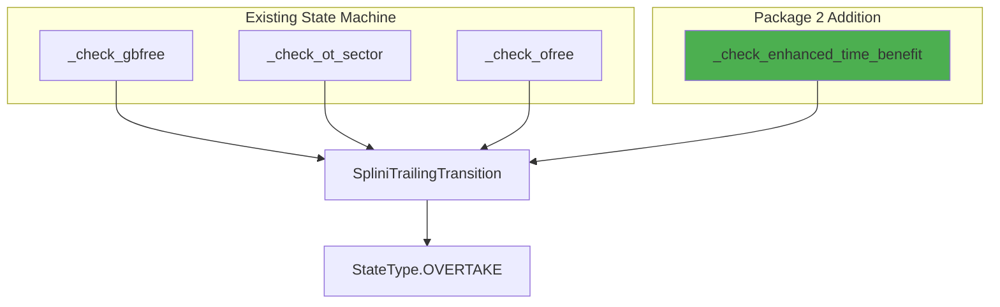
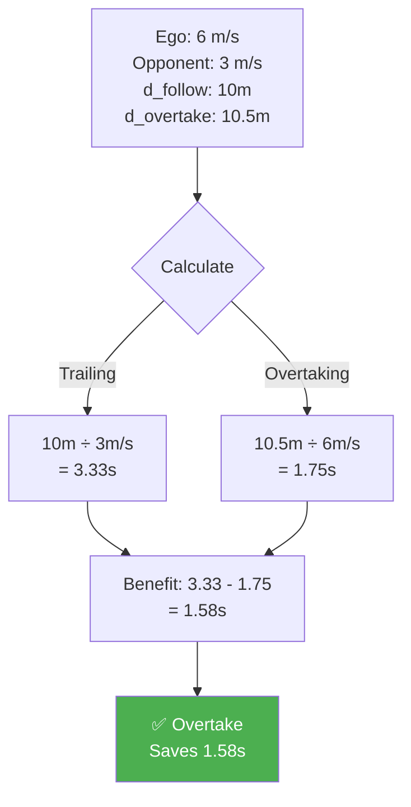

# Package 2: Enhanced Decision Planner - Implementation

## Overview

Package 2 adds intelligent time-benefit analysis to the ForzaETH state machine's overtaking decisions. Instead of overtaking whenever an opportunity arises, the system now evaluates whether the maneuver actually saves time compared to trailing the opponent.

**Key Feature**: Path-based time comparison using actual Spliner trajectories - **no arbitrary constants**.

## Message Interface

Package 2 is a pure decision layer that enhances existing state machine logic without publishing new topics.

### Input Topics

```
/car_state/frenet/odom (nav_msgs/Odometry)
└─ Provides: Ego velocity (self.cur_vs from msg.twist.twist.linear.x)
└─ Purpose: Calculate time-overtaking based on our speed

/perception/obstacles (f110_msgs/ObstacleArray)
└─ Provides: Opponent position (s_center, d_center) and velocity (vs)
└─ Purpose: Find closest opponent and calculate time-trailing

/planner/avoidance/otwpnts (nav_msgs/Path)
└─ Provides: Overtaking trajectory waypoints from Spliner
└─ Purpose: Calculate actual overtaking path distance

/overtake_opportunity (f110_msgs/OvertakeOpportunity) [OPTIONAL - Future]
└─ Provides: Safe zone indication from Package 1
└─ Purpose: Coordinate with curvature-based track analysis
```

### Output

**No new topics published** - Package 2 modifies state transitions internally

```mermaid
graph LR
    A[/car_state/frenet/odom] -->|cur_vs| SM[State Machine]
    B[/perception/obstacles] -->|opponent data| SM
    C[/planner/avoidance/otwpnts] -->|Spliner path| SM
    SM -->|enhanced checks| T[Transition Logic]
    T --> D{OVERTAKE?}
```

## Architecture

### Design Pattern: Property-Based Checks

The state machine already uses `@property` decorators for transition conditions. Package 2 follows this existing pattern to maintain code consistency.

**Existing Pattern**:
```python
@property
def _check_gbfree(self) -> bool:
    """Returns True if global track is obstacle-free"""
    # Implementation checks obstacles within horizon
```

**Package 2 Addition**:
```python
@property
def _check_enhanced_time_benefit(self) -> bool:
    """Returns True if overtaking saves time"""
    # Implementation compares trailing vs. overtaking time using paths
```

### Integration Strategy: Additive, Not Destructive

Package 2 adds **one additional AND condition** to the existing overtaking transition logic.

**Before (transitions.py:72)**:
```python
elif (
    not gb_free
    and ot_sector
    and state_machine._check_availability_splini_wpts
    and state_machine._check_ofree
):
    return StateType.OVERTAKE
```

**After (transitions.py:77)**:
```python
elif (
    not gb_free
    and ot_sector
    and state_machine._check_availability_splini_wpts
    and state_machine._check_ofree
    and state_machine._check_enhanced_time_benefit       # Package 2
):
    return StateType.OVERTAKE
```


```mermaid
flowchart TB
    subgraph "Existing State Machine"
        E1[_check_gbfree]
        E2[_check_ot_sector]
        E3[_check_ofree]
    end

    subgraph "Package 2 Addition"
        P1[_check_enhanced_time_benefit]
    end

    E1 & E2 & E3 & P1 --> TR[SpliniTrailingTransition]
    TR --> OT[StateType.OVERTAKE]

    style P1 fill:#4CAF50
```

## Implementation

### Path-Based Time-Benefit Analysis

**Core Concept**: Compare time to traverse racing line vs. actual Spliner overtaking trajectory

**Pure Physics Approach**: No arbitrary maneuver cost constants. Uses actual path distances.

```python
def calculate_time_benefit_from_paths(ego_velocity, opponent_velocity,
                                      following_distance, overtaking_waypoints):
    # Calculate overtaking path distance from Spliner
    d_overtake = calculate_arc_length(overtaking_waypoints)

    # Time comparison - pure kinematics
    time_follow = following_distance / opponent_velocity
    time_overtake = d_overtake / ego_velocity

    return time_follow - time_overtake  # Positive = saves time
```

**Key Innovation**: Uses real trajectory data from Spliner - accounts for geometric path difference while maintaining physical correctness.

### Arc Length Calculation

Calculates actual path distance by summing Euclidean distances between waypoints:

```python
@staticmethod
def calculate_arc_length(waypoints):
    total_distance = 0.0
    for i in range(len(waypoints) - 1):
        dx = waypoints[i+1].x - waypoints[i].x
        dy = waypoints[i+1].y - waypoints[i].y
        total_distance += sqrt(dx**2 + dy**2)
    return total_distance
```

### Example Calculation

**Scenario**: Ego at 6 m/s, Opponent at 3 m/s, Following distance 10m, Overtaking path 10.5m

```
Following Time:
  10.0m ÷ 3 m/s = 3.33 seconds

Overtaking Time:
  10.5m ÷ 6 m/s = 1.75 seconds

Time Benefit:
  3.33s - 1.75s = 1.58 seconds

Decision:
  1.58s ≥ 0.5s threshold → ✅ OVERTAKE
  (Velocity advantage overcomes longer path)
```

**Why this works**: Overtaking path is slightly longer geometrically (lateral deviation), but ego vehicle traverses it at higher velocity. The pure time comparison captures both effects.


```mermaid
graph TD
    A[Ego: 6 m/s<br/>Opponent: 3 m/s<br/>d_follow: 10m<br/>d_overtake: 10.5m] --> B{Calculate}
    B -->|Trailing| C[10m ÷ 3m/s<br/>= 3.33s]
    B -->|Overtaking| D[10.5m ÷ 6m/s<br/>= 1.75s]
    C & D --> E[Benefit: 3.33 - 1.75<br/>= 1.58s]
    E --> F[✅ Overtake<br/>Saves 1.58s]

    style F fill:#4CAF50,color:#fff
```

## Code Locations

| Component | File | Purpose |
|-----------|------|---------|
| **Arc Length Helper** | `state_machine/enhanced_decision/decision_logic.py:29` | `calculate_arc_length()` static method |
| **Decision Logic** | `state_machine/enhanced_decision/decision_logic.py:61` | `calculate_time_benefit_from_paths()` method |
| **Check Method** | `state_machine/state_machine.py:394` | `_check_enhanced_time_benefit()` property |
| **Transition Integration** | `state_machine/transitions.py:77` | Added condition to `SpliniTrailingTransition()` |
| **Parameters** | `stack_master/config/state_machine_params.yaml:29` | Configuration values |
| **Parameter Declarations** | `state_machine/state_machine_params.py:216` | Parameter descriptors |

## Configuration

**File**: `stack_master/config/state_machine_params.yaml`

```yaml
# Package 2: Enhanced Decision Planner (Path-Based)
enhanced_time_benefit_threshold: 0.5  # [s] Minimum time saving for overtaking
enhanced_lookahead_distance: 10.0     # [m] Following distance for comparison
use_safe_zone_check: false            # Enable Package 1 integration (optional)
```

**Parameters**:

| Parameter | Default | Range | Purpose |
|-----------|---------|-------|---------|
| `enhanced_time_benefit_threshold` | 0.5s | 0.0-5.0s | Minimum time saved to trigger overtake |
| `enhanced_lookahead_distance` | 10.0m | 5.0-30.0m | Distance along racing line for trailing time |

**Tuning Guidelines**:

**Time Benefit Threshold**:
- **Higher** (e.g., 1.0s): More conservative, requires larger time savings
- **Lower** (e.g., 0.2s): More aggressive, overtakes with small time gains
- **Default 0.5s**: Balanced approach

**Lookahead Distance**:
- **Higher** (e.g., 20.0m): Long-term planning horizon
- **Lower** (e.g., 5.0m): Immediate benefit focus
- **Default 10.0m**: Medium-term horizon (appropriate for F1/10 scale)

## Testing

### Build and Run

```bash
cd ~/ws
colcon build --packages-select state_machine
source install/setup.bash

# Run in simulation (head-to-head mode required)
ros2 launch stack_master head_to_head_launch.xml \
    racecar_version:=SIM \
    LU_table:=default \
    ctrl_algo:=PP
```

### Verification

**Expected Behavior**:
- State machine loads without errors
- Parameters are readable:
  ```bash
  ros2 param get /state_machine enhanced_time_benefit_threshold
  ros2 param get /state_machine enhanced_lookahead_distance
  ```
- Overtaking only occurs when time-benefit check passes
- No new topics published (verify with `ros2 topic list`)

**Debug Logging** (optional):
Add to `state_machine.py:456` for visibility:
```python
self.get_logger().info(
    f"Path-based benefit: {time_benefit:.2f}s "
    f"(d_follow={self.enhanced_decision.lookahead_distance:.1f}m, "
    f"d_overtake={d_overtake:.1f}m)"
)
```

## Implementation Status

| Feature | Status | Notes |
|---------|--------|-------|
| **Path-Based Time-Benefit** | ✅ Implemented | Uses Spliner trajectories, no arbitrary constants |
| **Arc Length Calculation** | ✅ Implemented | Handles nav_msgs/Path and direct waypoint formats |
| **Package 1 Integration** | 🔌 Ready | Message interface defined, awaiting Package 1 completion |

## Design Rationale

### Why Path-Based Instead of Constant Maneuver Cost?

**Problem with constants**: F1/10 tracks are small. Entire overtaking maneuvers take 1-2 seconds. Arbitrary constants (e.g., 1.5s) would dominate the calculation unrealistically.

**Path-based solution**:
- Uses actual trajectory from Spliner (already computed)
- Accounts for geometric path difference naturally
- Pure physics: `time = distance / velocity`
- No tuning required for different tracks/speeds

**Scale appropriateness**: At F1/10 scale, the path length difference (lateral deviation ~0.5m over 10m forward ≈ 10.01m total) adds only ~1-2% extra distance. The velocity difference is the dominant factor.

### Physical Interpretation

```
Trailing:  Travel 10m at opponent's speed (slower)
Overtaking: Travel ~10.5m at ego speed (faster)

Net effect: Longer path, but much higher speed → still faster overall
```

The formula correctly captures both geometric and kinematic effects without arbitrary assumptions.

## Future Work

### Package 1 Safe Zone Integration
**Status**: Interface ready, implementation pending
- Message: `f110_msgs/OvertakeOpportunity` already defined
- Topic: `/overtake_opportunity` subscription ready
- **Waiting On**: Package 1's curvature-based track section analyzer
- **Integration**: Add `use_safe_zone_check` parameter to enable when available

### Velocity-Dependent Path Analysis (Optional)
**Concept**: Account for speed reduction in tight sections
- Analyze path curvature from Spliner waypoints
- Estimate velocity profile along overtaking path
- Refine time calculation: `time = sum(segment_distance / segment_velocity)`
- **Status**: Not implemented - pure distance/velocity is sufficient for current needs

## References

- **Architecture Document**: `docs/251202-package2-path-based-architecture.md`
- **Original Proposal**: `docs/251123-overtaking-enhancement.md`
- **Implementation Spec**: `docs/251125-implementation-spec.md`
- **Team Coordination**: See `docs/project.md` for Package 1 and Package 3 dependencies
